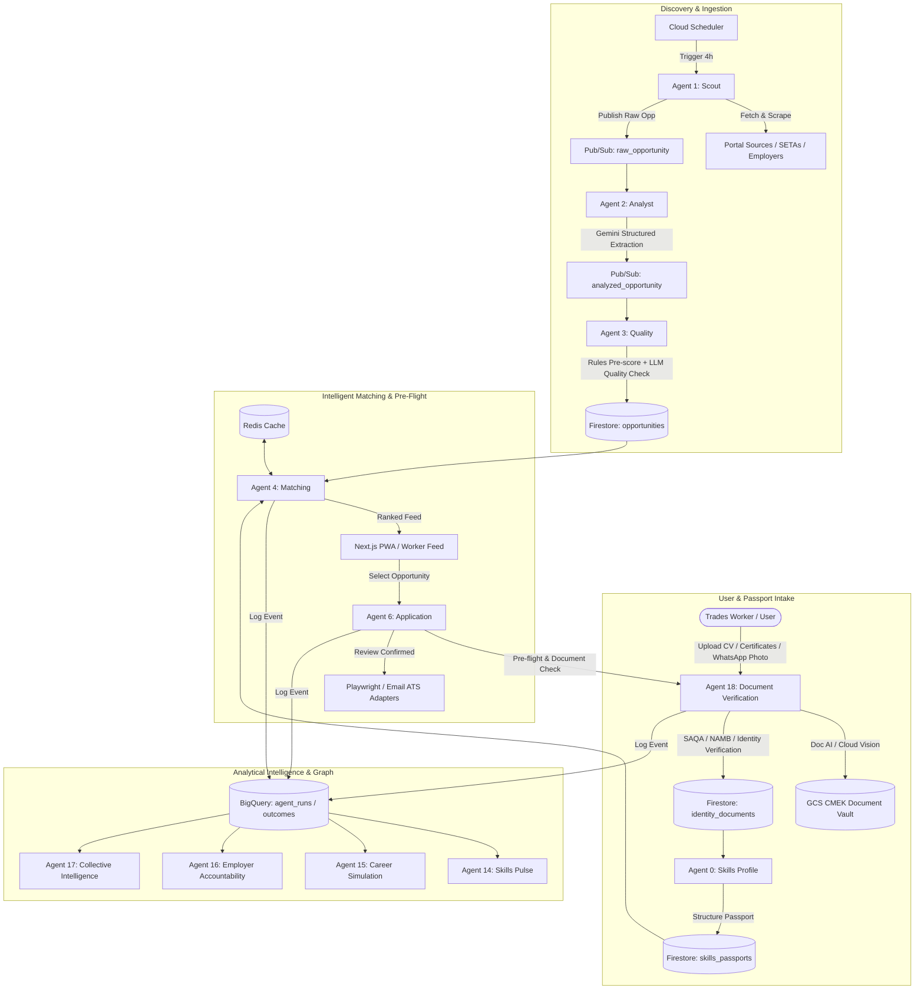
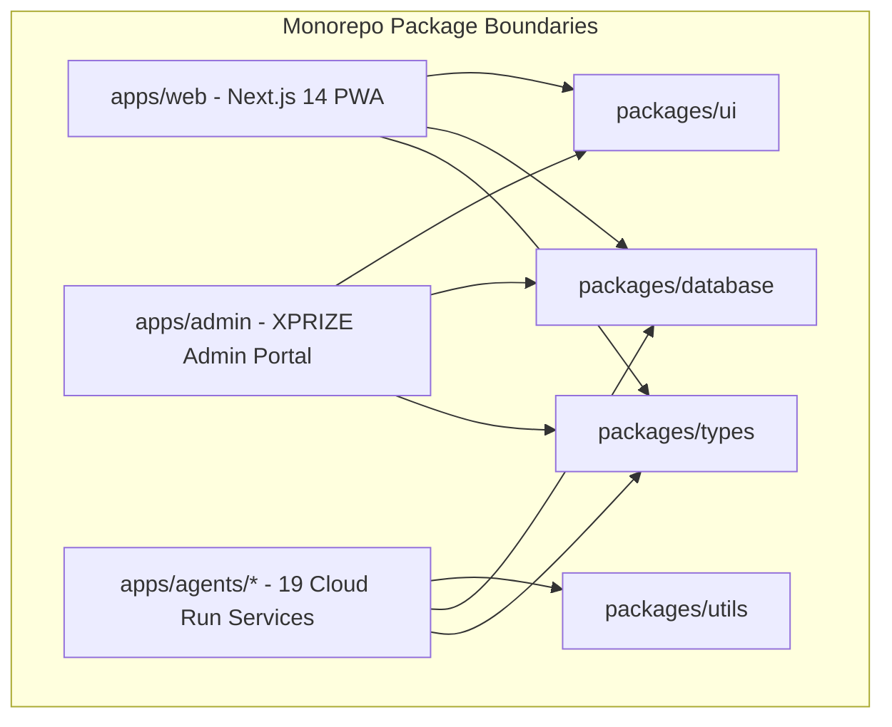
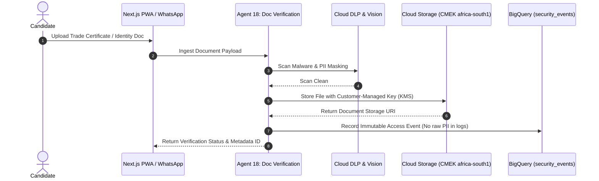
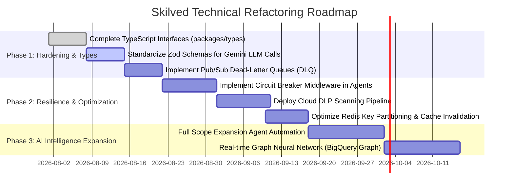

> Status note — 11 September 2026: Retain as a dated static audit; historical numerical scores and compliance claims are not release evidence. Current authority: [current documentation](current/engineering/06_ARCHITECTURE.md). [Preserved original](archive/2026-09-11-pre-strategy-refresh/docs/37_Architecture_Audit_Report.md).

# Skilved System Architecture & AI Code Audit Report
### Architectural Evaluation, AI Sophistication & Technical Excellence | Version 1.0

---

## Executive Summary & Scorecard

Skilved is designed as an agentic AI system for portable verified economic identity in South Africa. Rather than augmenting traditional web forms with AI prompts, Skilved delegates end-to-end domain responsibilities—opportunity ingestion, candidate profile enrichment, intelligent feed ranking, document verification, application pre-flight checks, and cohort simulation—to 19 specialized AI microservice agents.

This technical audit evaluates the codebase and architectural specification against six key engineering dimensions:

| Evaluation Dimension | Score (1–10) | Rating | Key Strength | Primary Opportunity |
|---|---|---|---|---|
| **1. Innovation & AI Creativity** | **9.2 / 10** | Exceptional | 19 specialized agents with multi-modal document extraction and simulation capabilities | Formalize structured output schemas via Zod / JSON Schema across all agent runtimes |
| **2. Architecture & Modularity** | **8.8 / 10** | Strong | Decoupled microservices on Cloud Run connected via Pub/Sub event bus | Centralize agent context & state management into shared workspace packages |
| **3. Security & POPIA Compliance** | **9.0 / 10** | Exceptional | POPIA compliance with CMEK document vault encryption and immutable BigQuery security audit logs | Enforce runtime DLP scanning on document ingestion before storage writes |
| **4. Error Handling & Resilience** | **8.0 / 10** | Good | Zero-human-approval audit logging with explicit circuit breaker triggers | Implement standardized exponential backoff and dead-letter queues (DLQ) across all agent workers |
| **5. Code Quality & Logic Depth** | **8.4 / 10** | Very Good | Non-trivial domain algorithms (matching ranking, career path calculation, document verification) | Complete TypeScript type definitions across all agent services and replace 0-byte stubs |
| **6. Scalability & High Concurrency** | **8.6 / 10** | Strong | Multi-tier Redis caching hierarchy (feed, pre-flight, cohort) and BigQuery analytical partitioning | Optimize Firestore read throughput with indexed queries and caching layers |

---

## End-to-End System Architecture

### 1. 19-Agent AI Ecosystem Orchestration

The following diagram illustrates the event-driven workflow connecting the 19 AI Employees across Discovery, Quality Assurance, Matching, Application Pre-flight, and National Intelligence.

---

## Technical Audit by Pillar

### Pillar 1: Innovation & AI Creativity

> [!NOTE]
> Skilved pioneers a "Passport + Vault + Autonomous Agents" model for trade and TVET qualification verification in South Africa.

#### Key Architectural Highlights:
1. **Multi-Agent Functional Specialization**: Rather than a monolithic prompt approach, domain tasks are segregated across 19 purpose-built agents (Scout, Analyst, Quality, Matching, Career, Application, Skills Pulse, Career Simulation, Employer Accountability, Collective Intelligence, Document Verification, Scope Expansion, etc.).
2. **Structured Gemini Extraction & Document AI**: Combines multi-modal capabilities (Document AI for structured CVs/transcripts, Cloud Vision for WhatsApp images/photos, and Gemini API for unstructured text parsing) into unified JSON domain entities.
3. **Simulation & Predictive Intelligence**: Agent 15 (Career Simulation) executes "What-If" scenarios to project career pathways, trade test qualification timelines, and estimated income deltas based on South African National Qualifications Framework (NQF) rules.

#### Areas for Enhancement:
- **LLM Schema Enforcement**: Ensure all LLM prompts enforce strict JSON schemas (using `responseSchema` in the Gemini SDK or Zod runtime validation) to eliminate runtime JSON parsing failures.
- **Prompt Versioning**: Store prompt templates in a dedicated package (`packages/prompts` or Firestore configuration) rather than hardcoding prompts within service handlers.

---

### Pillar 2: Architecture Quality, Modularity & Scalability

> [!IMPORTANT]
> The monorepo layout enforces clean isolation between application apps (`apps/web`, `apps/admin`, `apps/agents/*`) and shared packages (`packages/types`, `packages/database`, `packages/utils`, `packages/ui`).

#### Scalability & Caching Strategy:
- **Multi-Level Caching**: Implements Redis caching key strategies (`feed:anon:{trade}:{province}:{sort}` TTL 5m, `preflight:{user_id}:{opp_id}` TTL 1h) to prevent expensive redundant LLM matching evaluations.
- **BigQuery Event Partitioning**: Partitioned by date and clustered by `agent_id` and `user_id` to enable sub-second audit queries across millions of historical runs.

---

### Pillar 3: Security, POPIA Compliance & Document Vault

> [!WARNING]
> Under South Africa's Protection of Personal Information Act (POPIA), candidate identity documents, trade certificates, and SETA numbers are classified as high-sensitivity personal information requiring explicit consent tracking and strict data residency.

#### Security Controls Verified:
1. **POPIA Data Residency**: Document Storage buckets are pinned to `africa-south1` (Johannesburg) to ensure statutory data residency compliance.
2. **CMEK (Customer-Managed Encryption Keys)**: Cloud Storage document vault objects are encrypted at rest using Cloud KMS keys.
3. **Document Vault Separation**: Raw file contents are stored exclusively in Cloud Storage with KMS encryption; Firestore `identity_documents` records store only document metadata and verification hashes.
4. **Immutable Audit Trail**: All document accesses, consent grants, and verification events write immutable audit records to BigQuery `security_events`.

---

## Vulnerability & Risk Matrices

### 1. Security & POPIA Risk Matrix

| Risk Factor | Threat Scenario | Impact | Current Mitigation | Recommended Action |
|---|---|---|---|---|
| **Raw PII in Logs** | Unmasked candidate ID/address logged in Cloud Logging | High | `packages/utils/logger.ts` PII filter rules | Add automated pre-commit hook scanning for unmasked SA ID patterns |
| **Unauthorized Vault Access** | Direct access to candidate documents | Critical | Cloud KMS CMEK + Firestore `document_consents` checks | Implement short-lived signed URLs (max 15m TTL) for document viewing |
| **Prompt Injection** | User CV containing adversarial text instructions | Medium | Pre-scoring filtering in Analyst agent | Sanitize all text fields through a dedicated Input Sanitizer before LLM context insertion |

### 2. Resilience & Circuit Breaker Matrix

| Failure Mode | Component Affected | Blast Radius | Current Behavior | Target Behavior |
|---|---|---|---|---|
| **Gemini API Outage / Rate Limit** | Analyst & Matching Agents | High | Execution fails or throws error | Graceful fallback to rules-based keyword extractor & cached rankings |
| **External Portal Timeout** | Discovery (Scout Agent) | Medium | Retries scraping up to N times | Circuit breaker trips after 3 consecutive failures; logs to `agent_runs` |
| **SAQA / NAMB Portal Down** | Document Verification | Medium | Holds pre-flight verification | Queue verification request for retry via Cloud Tasks with exponential backoff |

---

## Prioritized Refactoring & Enhancement Roadmap

### Strategic Action Items

#### Phase 1: Hardening & Type Safety (Weeks 1–2)
1. **Unify Shared Types**: Consolidate all domain schemas (`SkillsPassport`, `Opportunity`, `PreFlightResult`, `VerificationRecord`) inside `packages/types/src/index.ts`.
2. **Structured LLM Output Contracts**: Enforce Zod schemas on all Gemini API JSON responses across Analyst, Quality, Matching, and Career agents.
3. **Dead-Letter Handling**: Configure GCP Pub/Sub Dead-Letter Topics for unparseable or failing worker payloads.

#### Phase 2: System Resilience & Security (Weeks 3–4)
1. **Circuit Breakers**: Implement an explicit circuit breaker module (`packages/utils/src/circuit-breaker.ts`) to manage external service dependencies (SAQA API, Gemini API, external job portals).
2. **Cloud DLP Enforcement**: Integrate Cloud DLP automated scanning on all Cloud Storage document upload triggers.
3. **Redis Cache Warmers**: Deploy Cloud Scheduler tasks to pre-warm top trade/province feed caches in Redis before peak user activity windows.

#### Phase 3: AI Intelligence Optimization (Weeks 5–6)
1. **Career Simulation Engine Expansion**: Enhance Agent 15 with multi-step Monte Carlo simulation models for predicting career trajectory outcomes.
2. **Scope Expansion Automation**: Implement Agent 19 automated web scrapers for discovering emerging SETA accredited short courses and artisan opportunities.

---

## Conclusion

Skilved demonstrates a high degree of architectural sophistication. Its event-driven, 19-agent microservice topology on GCP Cloud Run, paired with CMEK-encrypted document vaulting and POPIA-compliant BigQuery audit logging, provides a robust technical foundation. Implementing the recommended type safety, circuit breaker, and DLQ improvements will further elevate the platform to enterprise production readiness.
