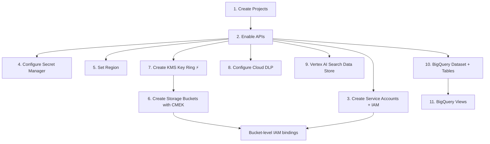

# GCP Setup via CLI — Complete Command Reference

> Based on [20_Sprint_Plan_2.md](file:///wsl.localhost/Ubuntu/home/lx_singw/projects/skilved/docs/20_Sprint_Plan_2.md) Sprint 0 checklist, [35_Security_Architecture.md](file:///wsl.localhost/Ubuntu/home/lx_singw/projects/skilved/docs/35_Security_Architecture.md), [14_Data_Models_Schema.md](file:///wsl.localhost/Ubuntu/home/lx_singw/projects/skilved/docs/14_Data_Models_Schema.md), and [19_CLAUDE_MD_2.md](file:///wsl.localhost/Ubuntu/home/lx_singw/projects/skilved/docs/19_CLAUDE_MD_2.md).

---

## TL;DR — Can It All Be Done via CLI?

**Yes — every single item can be provisioned from the command line.** But it's not just `gcloud` — you'll use three CLI tools:

| Tool | Used For |
|---|---|
| `gcloud` | Projects, APIs, IAM, Secret Manager, KMS, Storage, DLP, Vertex AI |
| `bq` | BigQuery datasets, tables, views |
| `gsutil` | Cloud Storage bucket-level config (alternative to `gcloud storage`) |

All three ship with the [Google Cloud SDK](https://cloud.google.com/sdk/docs/install).

> [!IMPORTANT]
> **Run these in order** — later steps depend on earlier ones (e.g., KMS key must exist before CMEK bucket, APIs must be enabled before creating resources).

---

## Prerequisites

```bash
# Install Google Cloud SDK (if not already)
# https://cloud.google.com/sdk/docs/install

# Authenticate
gcloud auth login
gcloud auth application-default login

# Confirm your billing account ID (needed for project creation)
gcloud billing accounts list
```

---

## 1. Create GCP Projects: `skilved-prod` + `skilved-dev`

✅ **Full CLI support**

```bash
# Create projects
gcloud projects create skilved-prod --name="Skilved Production"
gcloud projects create skilved-dev --name="Skilved Development"

# Link billing (replace BILLING_ACCOUNT_ID with yours)
gcloud billing projects link skilved-prod --billing-account=BILLING_ACCOUNT_ID
gcloud billing projects link skilved-dev --billing-account=BILLING_ACCOUNT_ID
```

> [!NOTE]
> Project IDs are globally unique. If `skilved-prod` is taken, you'll need a variant like `skilved-prod-za` or similar.

---

## 2. Enable All Required APIs

✅ **Full CLI support**

Based on the [GCP Services Used table](file:///wsl.localhost/Ubuntu/home/lx_singw/projects/skilved/docs/19_CLAUDE_MD_2.md#L121-L148):

```bash
# Set default project (repeat all commands for skilved-prod too)
gcloud config set project skilved-dev

# Enable all required APIs in one command
gcloud services enable \
  run.googleapis.com \
  cloudscheduler.googleapis.com \
  pubsub.googleapis.com \
  cloudfunctions.googleapis.com \
  documentai.googleapis.com \
  vision.googleapis.com \
  storage.googleapis.com \
  cloudkms.googleapis.com \
  dlp.googleapis.com \
  firestore.googleapis.com \
  bigquery.googleapis.com \
  aiplatform.googleapis.com \
  discoveryengine.googleapis.com \
  redis.googleapis.com \
  secretmanager.googleapis.com \
  monitoring.googleapis.com \
  logging.googleapis.com \
  iam.googleapis.com \
  cloudresourcemanager.googleapis.com \
  gmail.googleapis.com \
  cloudbuild.googleapis.com
```

> [!TIP]
> Run the same block with `gcloud config set project skilved-prod` for production.

---

## 3. Create Service Accounts with Least-Privilege IAM

✅ **Full CLI support**

From the [IAM Service Account Architecture](file:///wsl.localhost/Ubuntu/home/lx_singw/projects/skilved/docs/35_Security_Architecture.md#L279-L311):

```bash
PROJECT=skilved-dev

# Create service accounts
gcloud iam service-accounts create skilved-web \
  --project=$PROJECT \
  --display-name="Skilved Web Application"

gcloud iam service-accounts create skilved-agents \
  --project=$PROJECT \
  --display-name="Skilved AI Agents"

gcloud iam service-accounts create skilved-document-service \
  --project=$PROJECT \
  --display-name="Skilved Document Microservice"

gcloud iam service-accounts create skilved-verification \
  --project=$PROJECT \
  --display-name="Skilved SAQA/NAMB Verifier"

gcloud iam service-accounts create skilved-admin \
  --project=$PROJECT \
  --display-name="Skilved Admin"

# --- Bind IAM roles (least-privilege) ---

# skilved-web: Firestore read/write, BigQuery write events, Secret Manager read
gcloud projects add-iam-policy-binding $PROJECT \
  --member="serviceAccount:skilved-web@${PROJECT}.iam.gserviceaccount.com" \
  --role="roles/datastore.user"

gcloud projects add-iam-policy-binding $PROJECT \
  --member="serviceAccount:skilved-web@${PROJECT}.iam.gserviceaccount.com" \
  --role="roles/bigquery.dataEditor"

gcloud projects add-iam-policy-binding $PROJECT \
  --member="serviceAccount:skilved-web@${PROJECT}.iam.gserviceaccount.com" \
  --role="roles/secretmanager.secretAccessor"

# skilved-agents: Firestore, Storage (screenshots + CVs, NOT identity), BigQuery, Vertex AI
gcloud projects add-iam-policy-binding $PROJECT \
  --member="serviceAccount:skilved-agents@${PROJECT}.iam.gserviceaccount.com" \
  --role="roles/datastore.user"

gcloud projects add-iam-policy-binding $PROJECT \
  --member="serviceAccount:skilved-agents@${PROJECT}.iam.gserviceaccount.com" \
  --role="roles/bigquery.dataEditor"

gcloud projects add-iam-policy-binding $PROJECT \
  --member="serviceAccount:skilved-agents@${PROJECT}.iam.gserviceaccount.com" \
  --role="roles/aiplatform.user"

# skilved-document-service: Storage (ALL document buckets), KMS encrypt/decrypt, Firestore, BigQuery
gcloud projects add-iam-policy-binding $PROJECT \
  --member="serviceAccount:skilved-document-service@${PROJECT}.iam.gserviceaccount.com" \
  --role="roles/datastore.user"

gcloud projects add-iam-policy-binding $PROJECT \
  --member="serviceAccount:skilved-document-service@${PROJECT}.iam.gserviceaccount.com" \
  --role="roles/bigquery.dataEditor"

gcloud projects add-iam-policy-binding $PROJECT \
  --member="serviceAccount:skilved-document-service@${PROJECT}.iam.gserviceaccount.com" \
  --role="roles/cloudkms.cryptoKeyEncrypterDecrypter"

# skilved-verification: Storage read, Firestore update verification status
gcloud projects add-iam-policy-binding $PROJECT \
  --member="serviceAccount:skilved-verification@${PROJECT}.iam.gserviceaccount.com" \
  --role="roles/datastore.user"

# skilved-admin: Firestore read, BigQuery read, NO storage access
gcloud projects add-iam-policy-binding $PROJECT \
  --member="serviceAccount:skilved-admin@${PROJECT}.iam.gserviceaccount.com" \
  --role="roles/datastore.viewer"

gcloud projects add-iam-policy-binding $PROJECT \
  --member="serviceAccount:skilved-admin@${PROJECT}.iam.gserviceaccount.com" \
  --role="roles/bigquery.dataViewer"
```

> [!WARNING]
> **Bucket-level IAM** is needed to restrict which service accounts can access which buckets. The project-level roles above are starting points — you'll refine with bucket-level bindings below in step 6.

---

## 4. Configure Secret Manager

✅ **Full CLI support**

```bash
PROJECT=skilved-dev

# Create secrets (values added separately — never in scripts)
gcloud secrets create GEMINI_API_KEY --project=$PROJECT --replication-policy="user-managed" \
  --locations="africa-south1"

gcloud secrets create CAPTCHA_SOLVER_API_KEY --project=$PROJECT --replication-policy="user-managed" \
  --locations="africa-south1"

gcloud secrets create WHATSAPP_API_TOKEN --project=$PROJECT --replication-policy="user-managed" \
  --locations="africa-south1"

gcloud secrets create SAQA_API_URL --project=$PROJECT --replication-policy="user-managed" \
  --locations="africa-south1"

gcloud secrets create PAYFAST_MERCHANT_ID --project=$PROJECT --replication-policy="user-managed" \
  --locations="africa-south1"

gcloud secrets create PAYFAST_MERCHANT_KEY --project=$PROJECT --replication-policy="user-managed" \
  --locations="africa-south1"

gcloud secrets create ID_HASH_SALT --project=$PROJECT --replication-policy="user-managed" \
  --locations="africa-south1"

# Add a secret version (interactive — don't put the value in your shell history)
echo -n "YOUR_ACTUAL_KEY" | gcloud secrets versions add GEMINI_API_KEY \
  --project=$PROJECT --data-file=-
```

> [!CAUTION]
> Never put secret values in scripts or shell history. Use `echo -n "value" | gcloud secrets versions add ... --data-file=-` or pipe from a secure source. Better yet: use `gcloud secrets versions add SECRET_NAME --data-file=/path/to/secure/file`.

---

## 5. Set Primary Region `africa-south1`

✅ **Full CLI support**

```bash
# Set default region for the CLI session
gcloud config set compute/region africa-south1

# For Cloud Run defaults
gcloud config set run/region africa-south1
```

> [!NOTE]
> Per [19_CLAUDE_MD_2.md line 149](file:///wsl.localhost/Ubuntu/home/lx_singw/projects/skilved/docs/19_CLAUDE_MD_2.md#L149): Most services use `africa-south1`. **Vertex AI + Document AI use `us-central1`** because they're not available in Africa yet. Document Storage buckets MUST be in `africa-south1` for POPIA data residency.

---

## 6. Create Cloud Storage Buckets with CMEK

✅ **Full CLI support** — but must create KMS key first (step 7), then come back.

> [!IMPORTANT]
> **Dependency: Step 7 (KMS) must complete before this step.** The CMEK key must exist before you can create an encrypted bucket.

```bash
PROJECT=skilved-dev
KMS_KEY="projects/${PROJECT}/locations/africa-south1/keyRings/skilved-documents/cryptoKeys/document-encryption-key"

# --- Grant Cloud Storage service agent access to the KMS key ---
# Get the Cloud Storage service agent email
GCS_SA=$(gcloud storage service-agent --project=$PROJECT)

gcloud kms keys add-iam-policy-binding document-encryption-key \
  --project=$PROJECT \
  --location=africa-south1 \
  --keyring=skilved-documents \
  --member="serviceAccount:${GCS_SA}" \
  --role="roles/cloudkms.cryptoKeyEncrypterDecrypter"

# --- Create document storage bucket (CVs, certificates, transcripts) ---
gcloud storage buckets create gs://skilved-documents-dev \
  --project=$PROJECT \
  --location=africa-south1 \
  --default-storage-class=STANDARD \
  --uniform-bucket-level-access \
  --default-encryption-key=$KMS_KEY

# Enable versioning
gcloud storage buckets update gs://skilved-documents-dev --versioning

# Set lifecycle rule (delete old versions after 3 newer exist)
cat > /tmp/lifecycle.json << 'EOF'
{
  "rule": [
    {
      "action": {"type": "Delete"},
      "condition": {"numNewerVersions": 3}
    }
  ]
}
EOF
gcloud storage buckets update gs://skilved-documents-dev \
  --lifecycle-file=/tmp/lifecycle.json

# --- Create identity document bucket (ID docs, Smart IDs, passports) ---
gcloud storage buckets create gs://skilved-identity-dev \
  --project=$PROJECT \
  --location=africa-south1 \
  --default-storage-class=STANDARD \
  --uniform-bucket-level-access \
  --default-encryption-key=$KMS_KEY \
  --retention-period=31536000

# Enable versioning
gcloud storage buckets update gs://skilved-identity-dev --versioning

# --- Create screenshots bucket ---
gcloud storage buckets create gs://skilved-screenshots-dev \
  --project=$PROJECT \
  --location=africa-south1 \
  --default-storage-class=STANDARD \
  --uniform-bucket-level-access

# --- Create government reports bucket (Skills Pulse PDFs) ---
gcloud storage buckets create gs://skilved-government-reports-dev \
  --project=$PROJECT \
  --location=africa-south1 \
  --default-storage-class=STANDARD \
  --uniform-bucket-level-access

# --- Create audit logs bucket (immutable sink) ---
gcloud storage buckets create gs://skilved-audit-logs-dev \
  --project=$PROJECT \
  --location=africa-south1 \
  --default-storage-class=STANDARD \
  --uniform-bucket-level-access

# --- Bucket-level IAM: restrict skilved-agents from identity bucket ---
# Grant skilved-document-service access to BOTH document buckets
gcloud storage buckets add-iam-policy-binding gs://skilved-documents-dev \
  --member="serviceAccount:skilved-document-service@${PROJECT}.iam.gserviceaccount.com" \
  --role="roles/storage.objectAdmin"

gcloud storage buckets add-iam-policy-binding gs://skilved-identity-dev \
  --member="serviceAccount:skilved-document-service@${PROJECT}.iam.gserviceaccount.com" \
  --role="roles/storage.objectAdmin"

# Grant skilved-agents access ONLY to documents + screenshots (NOT identity)
gcloud storage buckets add-iam-policy-binding gs://skilved-documents-dev \
  --member="serviceAccount:skilved-agents@${PROJECT}.iam.gserviceaccount.com" \
  --role="roles/storage.objectViewer"

gcloud storage buckets add-iam-policy-binding gs://skilved-screenshots-dev \
  --member="serviceAccount:skilved-agents@${PROJECT}.iam.gserviceaccount.com" \
  --role="roles/storage.objectAdmin"

# skilved-verification: read-only access to documents for verification
gcloud storage buckets add-iam-policy-binding gs://skilved-documents-dev \
  --member="serviceAccount:skilved-verification@${PROJECT}.iam.gserviceaccount.com" \
  --role="roles/storage.objectViewer"
```

---

## 7. Configure Cloud KMS Key Ring for Document Encryption

✅ **Full CLI support**

```bash
PROJECT=skilved-dev

# Create the key ring in africa-south1
gcloud kms keyrings create skilved-documents \
  --project=$PROJECT \
  --location=africa-south1

# Create the encryption key with 90-day auto-rotation
gcloud kms keys create document-encryption-key \
  --project=$PROJECT \
  --location=africa-south1 \
  --keyring=skilved-documents \
  --purpose=encryption \
  --rotation-period=7776000s \
  --next-rotation-time=$(date -u -d "+90 days" +%Y-%m-%dT%H:%M:%SZ)
```

> [!NOTE]
> The `--rotation-period=7776000s` matches the 90-day rotation from [35_Security_Architecture.md line 232](file:///wsl.localhost/Ubuntu/home/lx_singw/projects/skilved/docs/35_Security_Architecture.md#L229-L237). Terraform has `prevent_destroy = true` — in CLI, there's no equivalent. Be very careful with `gcloud kms keys versions destroy`.

---

## 8. Configure Cloud DLP to Scan Logs for PII

✅ **Full CLI support** — but DLP is configured via **inspect templates** and **job triggers**, not simple one-liners.

```bash
PROJECT=skilved-dev

# Create a DLP inspect template for PII (SA ID numbers, etc.)
cat > /tmp/dlp-inspect-template.json << 'EOF'
{
  "inspectTemplate": {
    "displayName": "Skilved PII Scanner",
    "description": "Scans logs for SA ID numbers, names, and other PII that should never appear in logs",
    "inspectConfig": {
      "infoTypes": [
        {"name": "PERSON_NAME"},
        {"name": "PHONE_NUMBER"},
        {"name": "EMAIL_ADDRESS"},
        {"name": "STREET_ADDRESS"},
        {"name": "PASSPORT"},
        {"name": "SOUTH_AFRICA_ID_NUMBER"},
        {"name": "CREDIT_CARD_NUMBER"},
        {"name": "IBAN_CODE"}
      ],
      "minLikelihood": "LIKELY",
      "limits": {
        "maxFindingsPerRequest": 100
      }
    }
  }
}
EOF

gcloud dlp inspect-templates create \
  --project=$PROJECT \
  --location=africa-south1 \
  --template-id=skilved-pii-scanner \
  --json-file=/tmp/dlp-inspect-template.json

# Create a log sink to route Cloud Logging to DLP scanning
# First, create a Pub/Sub topic for log routing
gcloud pubsub topics create dlp-log-scan --project=$PROJECT

# Create a log sink that routes to the Pub/Sub topic
gcloud logging sinks create pii-log-scanner \
  "pubsub.googleapis.com/projects/${PROJECT}/topics/dlp-log-scan" \
  --project=$PROJECT \
  --log-filter='resource.type="cloud_run_revision" OR resource.type="cloud_function"'

# Grant the sink's service account permission to publish to the topic
SINK_SA=$(gcloud logging sinks describe pii-log-scanner --project=$PROJECT --format='value(writerIdentity)')
gcloud pubsub topics add-iam-policy-binding dlp-log-scan \
  --project=$PROJECT \
  --member="${SINK_SA}" \
  --role="roles/pubsub.publisher"
```

> [!WARNING]
> Cloud DLP log scanning is more complex than a single command. The above sets up the **infrastructure** — you'll also need a Cloud Function subscriber on the Pub/Sub topic that calls the DLP API to inspect each log entry and alerts on PII findings. This is typically done in application code or via a DLP **job trigger** for batch scanning.

---

## 9. Vertex AI Search Data Store Provisioned

✅ **CLI support via `gcloud`**

```bash
PROJECT=skilved-dev

# Create a Vertex AI Search data store
# NOTE: Vertex AI Search (Discovery Engine) may need us-central1
gcloud discovery-engine data-stores create skilved-opportunities \
  --project=$PROJECT \
  --location=global \
  --display-name="Skilved Opportunities" \
  --industry-vertical=GENERIC \
  --content-config=CONTENT_REQUIRED
```

> [!NOTE]
> Vertex AI Search (Discovery Engine) CLI commands are relatively new. If `gcloud discovery-engine` isn't available in your SDK version, update with `gcloud components update`. As an alternative, this can be done via the [Discovery Engine REST API](https://cloud.google.com/generative-ai-app-builder/docs/reference/rest).

---

## 10. BigQuery Datasets + All Tables Created

✅ **Full CLI support via `bq` command**

### Create Dataset

```bash
PROJECT=skilved-dev

# Create the dataset in africa-south1
bq mk --project_id=$PROJECT \
  --location=africa-south1 \
  --dataset skilved_dev

# For prod:
# bq mk --project_id=skilved-prod --location=africa-south1 --dataset skilved_prod
```

### Create Tables

Based on [14_Data_Models_Schema.md](file:///wsl.localhost/Ubuntu/home/lx_singw/projects/skilved/docs/14_Data_Models_Schema.md) and [35_Security_Architecture.md](file:///wsl.localhost/Ubuntu/home/lx_singw/projects/skilved/docs/35_Security_Architecture.md):

```bash
DATASET="${PROJECT}:skilved_dev"

# --- events ---
bq mk --table \
  --time_partitioning_field=event_at \
  --time_partitioning_type=DAY \
  --clustering_fields=event_type,user_id,opportunity_id \
  ${DATASET}.events \
  event_id:STRING,session_id:STRING,user_id:STRING,opportunity_id:STRING,event_type:STRING,event_at:TIMESTAMP,trade_filter:STRING,province_filter:STRING,sort_order:STRING,session_number:INTEGER,events_in_session:INTEGER,utm_source:STRING,utm_medium:STRING,utm_campaign:STRING,referrer:STRING,device_type:STRING,user_agent:STRING,opp_trade:STRING,opp_province:STRING,opp_type:STRING,opp_salary:FLOAT,opp_freshness_hours:FLOAT,match_score:FLOAT,match_position:INTEGER

# --- outcomes ---
bq mk --table \
  --time_partitioning_field=outcome_at \
  --time_partitioning_type=DAY \
  --clustering_fields=outcome_type,opp_trade,opp_province \
  ${DATASET}.outcomes \
  outcome_id:STRING,user_id:STRING,opportunity_id:STRING,outcome_type:STRING,outcome_at:TIMESTAMP,outcome_reported_at:TIMESTAMP,reported_by:STRING,opp_trade:STRING,opp_type:STRING,opp_province:STRING,opp_salary:FLOAT,opp_source:STRING,opp_organisation:STRING,user_trade:STRING,user_province:STRING,user_qualification:STRING,user_nqf_level:INTEGER,user_experience:STRING,user_trade_tested:BOOLEAN,days_to_apply:INTEGER,days_to_outcome:INTEGER

# --- agent_runs ---
bq mk --table \
  --time_partitioning_field=started_at \
  --time_partitioning_type=DAY \
  --clustering_fields=agent_name,status \
  ${DATASET}.agent_runs \
  run_id:STRING,agent_name:STRING,started_at:TIMESTAMP,completed_at:TIMESTAMP,duration_seconds:FLOAT,status:STRING,sources_attempted:INTEGER,sources_succeeded:INTEGER,sources_failed:INTEGER,opportunities_found:INTEGER,opportunities_published:INTEGER,opportunities_rejected:INTEGER,opportunities_duplicate:INTEGER,opportunities_reviewed:INTEGER,auto_published:INTEGER,auto_rejected:INTEGER,flagged_for_review:INTEGER,users_targeted:INTEGER,digests_sent:INTEGER,digests_failed:INTEGER,followups_sent:INTEGER,outcomes_collected:INTEGER,error_count:INTEGER,human_approvals_required:INTEGER

# --- quality_decisions ---
bq mk --table \
  --time_partitioning_field=decided_at \
  --time_partitioning_type=DAY \
  --clustering_fields=decision,source_name \
  ${DATASET}.quality_decisions \
  decision_id:STRING,opportunity_id:STRING,agent_run_id:STRING,decided_at:TIMESTAMP,decision:STRING,quality_score:FLOAT,gemini_score:FLOAT,gemini_reasoning:STRING,source_score:FLOAT,source_name:STRING,rejection_reason:STRING,user_reported_issue:BOOLEAN,user_report_reason:STRING,overridden_by_human:BOOLEAN,human_decision:STRING

# --- graph_skills ---
bq mk --table \
  --time_partitioning_field=last_updated \
  --time_partitioning_type=DAY \
  --clustering_fields=trade,nqf_level \
  ${DATASET}.graph_skills \
  skill_id:STRING,trade:STRING,qualification:STRING,nqf_level:INTEGER,avg_salary_accessible:FLOAT,max_salary_accessible:FLOAT,min_salary_accessible:FLOAT,apply_to_interview_rate:FLOAT,apply_to_offer_rate:FLOAT,offer_to_accept_rate:FLOAT,avg_days_to_placement:FLOAT,applicant_count:INTEGER,outcome_count:INTEGER,confidence_score:FLOAT,last_updated:TIMESTAMP

# --- security_events (NEW v6.0) ---
bq mk --table \
  --time_partitioning_field=event_at \
  --time_partitioning_type=DAY \
  ${DATASET}.security_events \
  event_id:STRING,event_type:STRING,user_id:STRING,ip_address:STRING,user_agent:STRING,document_id:STRING,document_type:STRING,action:STRING,success:BOOLEAN,failure_reason:STRING,risk_score:FLOAT,event_at:TIMESTAMP

# --- document_verification_events (NEW v6.0) ---
bq mk --table \
  --time_partitioning_field=verified_at \
  --time_partitioning_type=DAY \
  ${DATASET}.document_verification_events \
  event_id:STRING,document_id:STRING,user_id:STRING,document_type:STRING,verification_source:STRING,verification_status:STRING,verification_reference:STRING,verified_at:TIMESTAMP,details:STRING
```

> [!NOTE]
> The `agent_runs` table has an `ARRAY<STRING>` column (`error_messages`) in the SQL definition. The `bq mk --table` inline schema doesn't support ARRAY types — for that column, use a JSON schema file instead:

```bash
# For tables with ARRAY columns, use a schema file
cat > /tmp/agent_runs_schema.json << 'EOF'
[
  {"name": "run_id", "type": "STRING", "mode": "REQUIRED"},
  {"name": "agent_name", "type": "STRING", "mode": "REQUIRED"},
  {"name": "started_at", "type": "TIMESTAMP", "mode": "REQUIRED"},
  {"name": "completed_at", "type": "TIMESTAMP"},
  {"name": "duration_seconds", "type": "FLOAT64"},
  {"name": "status", "type": "STRING"},
  {"name": "sources_attempted", "type": "INT64"},
  {"name": "sources_succeeded", "type": "INT64"},
  {"name": "sources_failed", "type": "INT64"},
  {"name": "opportunities_found", "type": "INT64"},
  {"name": "opportunities_published", "type": "INT64"},
  {"name": "opportunities_rejected", "type": "INT64"},
  {"name": "opportunities_duplicate", "type": "INT64"},
  {"name": "opportunities_reviewed", "type": "INT64"},
  {"name": "auto_published", "type": "INT64"},
  {"name": "auto_rejected", "type": "INT64"},
  {"name": "flagged_for_review", "type": "INT64"},
  {"name": "users_targeted", "type": "INT64"},
  {"name": "digests_sent", "type": "INT64"},
  {"name": "digests_failed", "type": "INT64"},
  {"name": "followups_sent", "type": "INT64"},
  {"name": "outcomes_collected", "type": "INT64"},
  {"name": "error_count", "type": "INT64"},
  {"name": "error_messages", "type": "STRING", "mode": "REPEATED"},
  {"name": "human_approvals_required", "type": "INT64"}
]
EOF

# Drop the simplified table and recreate with full schema
bq rm -f ${DATASET}.agent_runs
bq mk --table \
  --time_partitioning_field=started_at \
  --time_partitioning_type=DAY \
  --clustering_fields=agent_name,status \
  ${DATASET}.agent_runs \
  /tmp/agent_runs_schema.json
```

Similarly for `quality_decisions` which has `ARRAY<STRING>` columns (`rules_passed`, `rules_failed`):

```bash
cat > /tmp/quality_decisions_schema.json << 'EOF'
[
  {"name": "decision_id", "type": "STRING", "mode": "REQUIRED"},
  {"name": "opportunity_id", "type": "STRING", "mode": "REQUIRED"},
  {"name": "agent_run_id", "type": "STRING", "mode": "REQUIRED"},
  {"name": "decided_at", "type": "TIMESTAMP", "mode": "REQUIRED"},
  {"name": "decision", "type": "STRING", "mode": "REQUIRED"},
  {"name": "quality_score", "type": "FLOAT64"},
  {"name": "rules_passed", "type": "STRING", "mode": "REPEATED"},
  {"name": "rules_failed", "type": "STRING", "mode": "REPEATED"},
  {"name": "gemini_score", "type": "FLOAT64"},
  {"name": "gemini_reasoning", "type": "STRING"},
  {"name": "source_score", "type": "FLOAT64"},
  {"name": "source_name", "type": "STRING"},
  {"name": "rejection_reason", "type": "STRING"},
  {"name": "user_reported_issue", "type": "BOOLEAN"},
  {"name": "user_report_reason", "type": "STRING"},
  {"name": "overridden_by_human", "type": "BOOLEAN"},
  {"name": "human_decision", "type": "STRING"}
]
EOF

bq rm -f ${DATASET}.quality_decisions
bq mk --table \
  --time_partitioning_field=decided_at \
  --time_partitioning_type=DAY \
  --clustering_fields=decision,source_name \
  ${DATASET}.quality_decisions \
  /tmp/quality_decisions_schema.json
```

---

## 11. BigQuery `agent_autonomy` View Created

✅ **Full CLI support via `bq`**

From [14_Data_Models_Schema.md lines 1177-1195](file:///wsl.localhost/Ubuntu/home/lx_singw/projects/skilved/docs/14_Data_Models_Schema.md#L1176-L1195):

```bash
DATASET="${PROJECT}:skilved_dev"

# agent_autonomy view — XPRIZE demonstration
bq mk --use_legacy_sql=false --view \
"SELECT
  DATE(started_at) as date,
  agent_name,
  COUNT(*) as runs,
  SUM(opportunities_found) as total_found,
  SUM(opportunities_published) as total_published,
  SUM(digests_sent) as total_digests,
  SUM(outcomes_collected) as total_outcomes,
  SUM(human_approvals_required) as human_interventions,
  SAFE_DIVIDE(
    SUM(human_approvals_required),
    COUNT(*)
  ) as human_intervention_rate
FROM \`${PROJECT}.skilved_dev.agent_runs\`
GROUP BY date, agent_name
ORDER BY date DESC" \
${DATASET}.agent_autonomy

# daily_metrics view
bq mk --use_legacy_sql=false --view \
"SELECT
  DATE(event_at) as date,
  COUNT(DISTINCT session_id) as daily_sessions,
  COUNT(DISTINCT user_id) as daily_active_users,
  COUNTIF(event_type = 'opportunity_detail') as detail_views,
  COUNTIF(event_type = 'apply_click') as apply_clicks,
  COUNTIF(event_type = 'share') as shares,
  COUNTIF(event_type = 'signup_complete') as new_signups,
  SAFE_DIVIDE(
    COUNTIF(event_type = 'apply_click'),
    COUNTIF(event_type = 'opportunity_detail')
  ) as apply_click_rate,
  SAFE_DIVIDE(
    COUNTIF(event_type = 'share'),
    COUNTIF(event_type = 'opportunity_detail')
  ) as share_rate
FROM \`${PROJECT}.skilved_dev.events\`
GROUP BY date
ORDER BY date DESC" \
${DATASET}.daily_metrics
```

---

## Execution Order Summary



> [!TIP]
> **Automation suggestion:** These commands could be wrapped into a single bash script (`scripts/gcp-setup.sh`) in the repo. However, given that your project already has a [Terraform infrastructure directory](file:///wsl.localhost/Ubuntu/home/lx_singw/projects/skilved/infrastructure) with empty module files, the better long-term approach is to populate those `.tf` files. The CLI commands above are ideal for **initial bootstrapping** and **testing in dev** before codifying in Terraform.

---

## CLI vs Terraform — Which to Use?

| Approach | Best For | Risk |
|---|---|---|
| **CLI (this doc)** | Sprint 0 fast setup, dev environment, testing | No state tracking — drift possible |
| **Terraform (existing infra/)** | Production, reproducibility, team collaboration | Slower initial setup |

**Recommendation:** Use CLI for `skilved-dev` right now to unblock Sprint 1. Then populate the Terraform modules in `infrastructure/` for `skilved-prod` to get state management and reproducibility.
