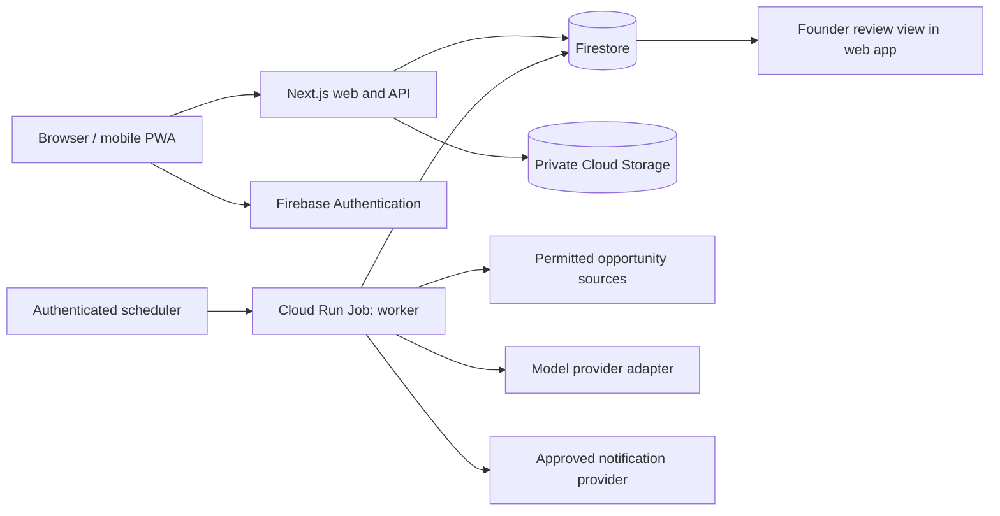

# Skilved architecture and engineering decisions

13 September M0 implementation: the [companion contract](04_DISCOVERY_COMPANION_IMPLEMENTATION.md) defines the public read/review/fetch boundary, browser-local progress, safe suggestions and cache invalidation. It reuses the reference architecture; no new graph database, learner account, full agent platform or institutional integration is required for M0. Disable unready sensitive routes at the server/deployment boundary.

Status: proposed build baseline, 11 September 2026. This document specifies the target; it does not certify deployment, security or working integrations.
Owner: founder/engineering. Scope: R0–R5. Companion contracts: [data and APIs](07_DATA_AND_API_CONTRACTS.md), [agent execution](08_AGENT_EXECUTION.md), [release evidence](../quality/11_VALIDATION_AND_RELEASE.md).

## 1. Architecture objective

Support the complete career-progress journey: discover, understand, prepare, obtain help, apply externally, record outcomes and reuse evidence.
All six opportunity categories share this journey: bursaries, learnerships, apprenticeships, internships, graduate programmes and jobs.
Separate logical capabilities from deployment units. A capable agent does not require its own always-running service.
Preserve room for groups, organisational workflows, accepted evidence, credentials and post-placement support without provisioning their future infrastructure immediately.
Engineering choices should improve delivery reliability, maintainability and measured cost; cloud credits alone do not determine them.

## 2. Evidence baseline

The following observations came from selective, read-only repository inspection. No live project, cloud bill, deployed URL or end-to-end test was inspected.

| Observed source | Evidence | Consequence |
|---|---|---|
| `apps/web/package.json` | Next.js `^15.1.0`, React `^19.0.0`, TypeScript and Tailwind declared | Legacy Next.js 14 descriptions are stale; audit installed/resolved versions before release |
| `apps/agents/scout/package.json` | Agent package is currently a Next.js application | Treat agent-to-worker consolidation as engineering work |
| `apps/web/src/app/api/profile/route.ts` | Requests use a shared demo username | Real authentication and ownership are not implemented by that route |
| Web auth/Firebase helpers and several database files | TODO/empty implementations | Do not count real persistence as completed |
| StudentRoom crawler and document verifier | Hardcoded opportunity/verification output | Replace or isolate fixtures before admitting real users |
| `packages/types/src/opportunity.ts` | Internship and graduate-programme variants absent | Expand schema and behaviour together |
| `.github` | No workflow directory found at inspection | Documented automated deployments are plans |
| `firestore.rules`, `storage.rules` | Role-field and screenshot access risks | R0 negative security tests and fixes are release gates |
| Cloud Run Terraform module | Public invocation; shared concurrency/scaling defaults | Split public and private invocation and measure resource settings |

The historical architecture audit's numerical scores and claims of verified compliance are not release evidence.
Record future inspections with commit, configuration digest, environment, command and result; do not turn this snapshot into a permanent claim about code.

## 3. Target deployment

The web service owns interactive requests and rendering. Slow collection, extraction and bulk reminders execute in bounded worker jobs.
Initially one worker image can expose subcommands such as `discover`, `process-tasks`, `reconcile` and `expire-opportunities`.
The scheduler invokes authenticated Google execution APIs using a dedicated identity; it does not call an unauthenticated agent endpoint.
Queued user work persists immediately and receives a task ID; the UI can poll status without holding an HTTP request open.
Start with scheduled queue drains. Introduce authenticated on-demand dispatch only if measured waiting time damages a real user journey.

## 4. Technology decisions

| Decision ID | Default | Revisit condition |
|---|---|---|
| ENG-01 | Keep Google Cloud/Firebase as initial provider | Measured operating cost, capability gap or committed partner requirement justifies migration |
| ENG-02 | Next.js, TypeScript, Tailwind; pnpm workspace | Current dependencies cannot be maintained safely or materially obstruct delivery |
| ENG-03 | One web service and scheduled worker executions | Workload isolation, security boundary or measured independent scale warrants another service |
| ENG-04 | Firestore initial operational store | Relational reporting/permissions/query fan-out make PostgreSQL demonstrably better before institutional expansion |
| ENG-05 | Firebase Authentication with server-side authorization | Actual identity/institutional federation needs require an extension |
| ENG-06 | Private object storage for enabled uploads | Partner requirements change storage controls; never because a public bucket is easier |
| ENG-07 | One model adapter initially, strict output schema | Another provider beats measured quality/cost/latency or supplies required processing terms |
| ENG-08 | Structured filters and eligibility rules first | Search relevance evidence supports adding a search index or embeddings |
| ENG-09 | Durable task/outbox records; no Redis prerequisite | Measured contention or coordination need justifies an added component |
| ENG-10 | Relevant operational events first, warehouse later | Reporting cost/volume or a contracted analysis need justifies BigQuery |

These are default decisions under the founder's delegation. Record evidence and changes in [decision register](../governance/14_DECISIONS_AND_ASSUMPTIONS.md).
No initial cloud spend is authorised merely by writing these documents; use the funding controls in [cost and capacity](../operations/12_COST_CAPACITY_AND_OPERATIONS.md).

## 5. Code structure and migration

Retain the monorepo. Proposed logical boundaries are `web`, `worker`, `domain`, `contracts`, `database`, `integrations` and shared UI/configuration.
Do not create empty packages solely to match a diagram. Extract a package when two consumers need a stable contract.
Keep opportunity parsing, eligibility, permission checks and task state transitions independently testable from provider SDKs.
Move useful existing agent functions into worker modules incrementally; retain original names in the migration map for traceability.
Delete or clearly isolate fixture-only runtime paths when replacing them; do not silently fall back to fabricated live results.
Choose runtime and dependency versions from supported releases at implementation; resolve lockfile and build evidence before describing them as tested.
The web and worker may share one repository while using distinct service identities and deployment configurations.

## 6. Authentication and service boundaries

The browser signs in using Firebase Authentication; the API verifies the token and derives the subject from it.
Never accept a body `userId`, email or organisation role as authority. Apply resource ownership and membership checks on every operation.
Use server-only credentials via managed runtime identity, with least privilege. Avoid production service-account key files where managed identity suffices.
Administrative role assignment is server-controlled and separately audited; users may not change protected role/issuer fields in their own document.
Firebase Admin/server clients bypass Firestore Security Rules, so the server must perform its own authorization. See [Firebase server client security](https://firebase.google.com/docs/firestore/security/rules-conditions).
Separate public catalogue reads, authenticated learner operations, coordinator operations, source administration and worker actions.
An organisation coordinator has access only to active memberships and explicitly shared learner information; employment at a partner is not universal access.
Limit public invocation to the web surface. Workers and administrative infrastructure require authenticated invocation.
No real identity-document collection until the storage/privacy release gate passes; checklists and synthetic files can support earlier demonstrations.

## 7. Data placement and storage

Choose a supported primary region after checking each service's current availability, pricing and processing locations.
Johannesburg is the preferred operational location where appropriate, not a claim that location alone establishes legal compliance.
Document every cross-region/provider transfer and review it under [trust and privacy](../security/10_TRUST_PRIVACY_AND_SAFETY.md).
Store file content in private object storage and metadata in the database. Metadata can itself contain personal information and requires protection.
Use a quarantine/validation step before a new file becomes shareable. Content type supplied by the client is not proof of file type.
Set private access, size/type limits, malware-control approach, lifecycle/deletion policy and audit events before enabling uploads.
Signed URLs are bearer access until expiry; keep lifetimes short and disclose the limit of revocation. Use mediated access where immediate revocation is required.
Separate public portfolio projections from private originals. An export or share must include only the selected fields/items.
Neither document presence nor a checksum constitutes verified identity or qualification achievement.

## 8. Firestore versus PostgreSQL gate

R0/R1 use explicit repository interfaces and versioned records, not a generic database abstraction for every hypothetical provider.
Before R3 organisational reporting grows, prototype representative queries on realistic synthetic data: cohort readiness, grants, referrals, placement follow-up and issuer history.
Measure query count, latency, duplication, transaction contention, reporting complexity and total recurring cost.
Choose SQL only with a migration plan: stable public IDs, schema mapping, reconciled record counts, ownership tests, backfill, cutover, rollback and export compatibility.
Do not operate two writable systems of record casually. During migration, define the authoritative store for each entity and freeze/queue incompatible writes.
Record the result as an ADR with options, measurements, owner and review date. Lack of a SQL migration is not itself technical failure.

## 9. Capacity and operating controls

Set web concurrency and job parallelism separately. Heavy browser extraction should not inherit web request concurrency blindly.
Begin with one worker task claim at a time per job while validating safety; increase only after race and resource tests.
Cloud Run concurrency affects instance count, performance and cost. Its maximum is not a guarantee of application safety. [Google concurrency guidance](https://docs.cloud.google.com/run/docs/about-concurrency)
Bound request sizes, task duration, maximum attempts, source fetch pages, model tokens and execution fan-out.
Reserve and reconcile per-task cost estimates before paid operations. Provide global and per-capability stop switches.
Configure instance/job limits, alerts and provider controls; none alone proves a precise invoice ceiling.
Cache source snapshots and validated extraction by content hash. A page view should not automatically cause an AI call.
Use paginated queries and precomputed public projections where useful; avoid reading all users/opportunities for every request.
Instrument document reads/writes and outbound bytes alongside model usage. Cheap inference can coexist with expensive data access.
Graceful degradation: serve dated source-linked records and manual checklists when AI is unavailable; stop claims requiring unavailable evidence.

## 10. Deployment and environment model

R0: local development with emulators, fixture data and explicitly disabled outbound side effects.
R1: isolated alpha environment with invited users, minimal managed resources and human-reviewed opportunities.
R2: production plus a small representative test environment; preserve local development as the normal workflow.
Create a reproducible deployment manifest including image digest, schema version, configuration revision and feature flags.
Use a consistent infrastructure owner: Terraform-managed resources must not compete with undocumented shell-script mutations.
Review old setup scripts before use; do not run the historical full-service provisioning sequence merely because billing is enabled.
CI must exist and pass before claiming automated delivery. Add lint/type/build/security/critical-journey checks appropriate to actual packages.
A production release records migration compatibility, rollback image, outstanding risks and evidence links. See [release contract](../quality/11_VALIDATION_AND_RELEASE.md).

## 11. Phased engineering boundaries

| Phase | Engineering outcome | Exit evidence |
|---|---|---|
| R0 foundation | Honest prototype baseline, auth design, secured ownership, tested shared types, durable task skeleton | ENG-01–10 recorded; REL-R0 complete |
| R1 supervised alpha | Private learner journey, manual/source-linked catalogue, bounded worker, review and support | Cross-user isolation, persistence/retry recovery, participant observation |
| R2 public MVP | Six-category coverage, operational source maintenance, exports/sharing, monitoring and support | Category quality gates, production restore/release evidence |
| R3 groups and partner evidence | Scoped organisations/groups/referrals and issuer attestations | Tenant-isolation and partner-acceptance evidence; database ADR reviewed |
| R4 institutional support | Institution integrations, credentials/RPL and post-placement workflows | Signed partner interfaces, issuer authority, operational support capacity |
| R5 advanced intelligence/global | Validated intelligence and country-specific adaptation | Data sufficiency, independent evaluation, funding and local operating evidence |

## 12. Engineering acceptance records

- **ENG-11:** inventory maps each route/worker to implemented, fixture, absent or planned; no unsupported live claims.
- **ENG-12:** two distinct users cannot read or alter each other's private data; role mutation attempts fail.
- **ENG-13:** job invocation is authenticated; public web access cannot invoke privileged worker actions.
- **ENG-14:** costs and execution counts can be attributed to a capability, source and release without logging private payloads.
- **ENG-15:** one failed model/provider call leaves a recoverable task and truthful user state.
- **ENG-16:** normal public browsing does not invoke paid AI; catalogue reads remain useful during model outage.
- **ENG-17:** a deployment can be reproduced and rolled back with its data-compatibility conditions documented.
- **ENG-18:** the relational-store review occurs before institutional scope is assumed to fit the initial store.

## 13. Evidence limits and maintenance

Vendor guidance consulted 11 September 2026; check again before implementation or material provider changes.
Firestore transactions support atomic grouped writes, but external calls require the durable outbox contract rather than inclusion in a transaction. [Firestore transactions](https://firebase.google.com/docs/firestore/manage-data/transactions)
ID-token verification authenticates a user; resource authorization remains Skilved's responsibility. [Firebase token verification](https://firebase.google.com/docs/auth/admin/verify-id-tokens)
The roadmap's effort ranges are uncalibrated planning estimates. They do not establish available cash, complete implementation or guaranteed delivery dates.
Update this architecture when a decision changes, preserving its rationale and superseded version through version control and the historical archive.
